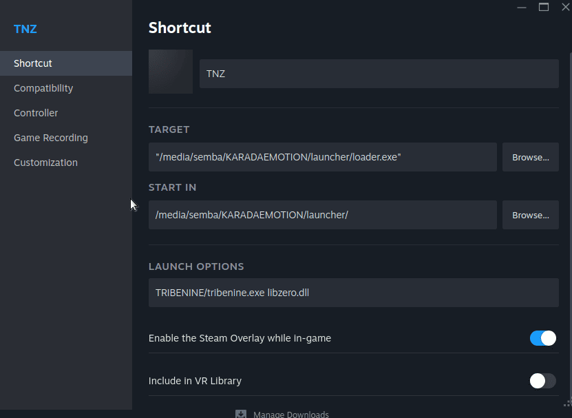
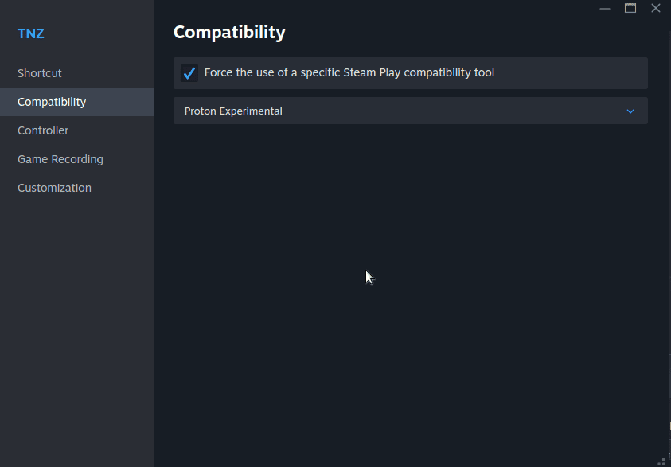

**Edit: The following instructions are outdated, the loader and the launcher are no more. The only part that
makes sense it's to use Proton Experimental.**

The launcher doesn't work in Proton so you have to configure the loader arguments before playing:

- Download the [latest release](https://24tribe.github.io/releases/)
- Extract it in the same drive as your TRIBENINE game folder
- Move your TRIBENINE game folder inside the launcher's folder
- Open Steam > Games > Add Non-Steam game to library...
- Select the loader.exe from the launcher folder (NOT launcher.exe)
- After that edit the game properties
- In the Shortcut launch options put `TRIBENINE/tribenine.exe libzero.dll` ("TRIBENINE/tribenine.exe" should be the relative path to the game executable)

- In the Compatibility tab, tick "Force the use of a specific Steam Play compatibility tool" and select "Proton Experimental".

After that it should work. Note that the loader closes after launching the game, so the "start game button" doesn't show the game running.