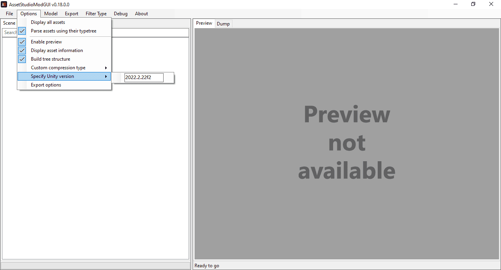
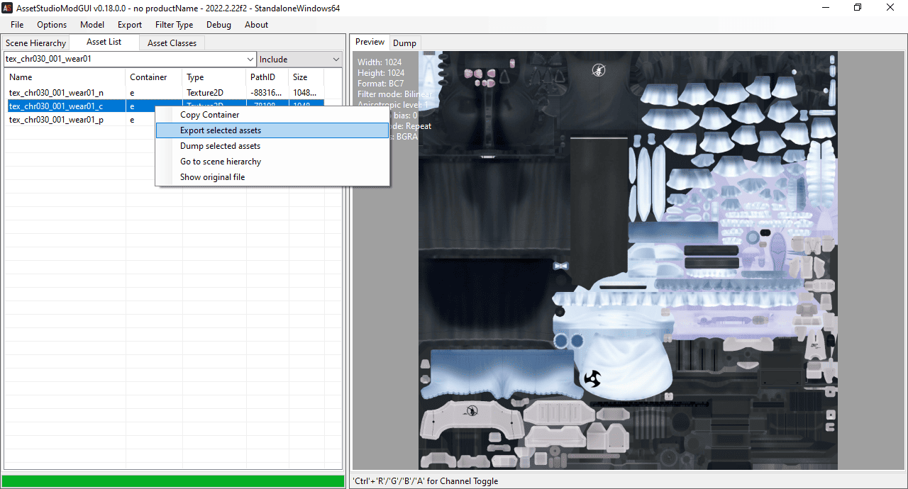
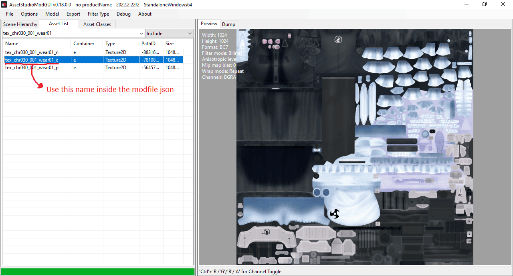
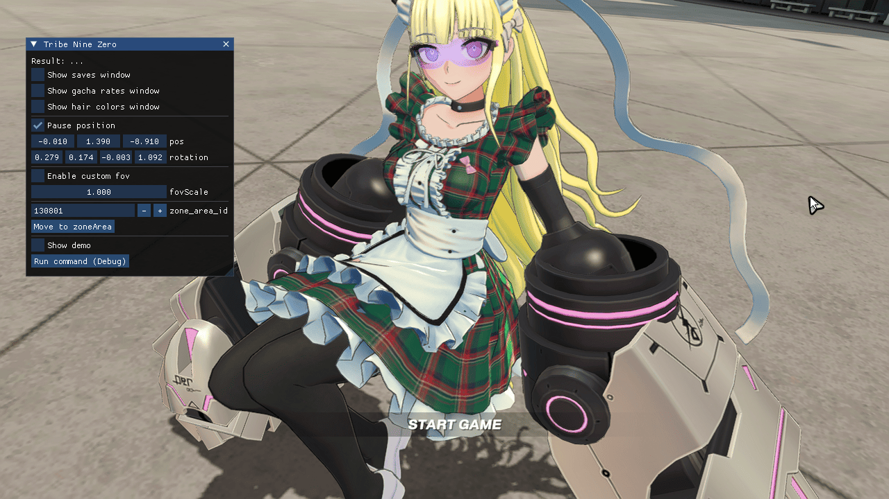

Texture mods
============

Right now you can replace the textures inside the asset bundles of the game by other means,
because the game doesn't check if an asset changed. But if you don't want to repackage asset
bundles, TNZ has support for texture mods.

Texture mod structure
---------------------
Each texture mod should have its own folder in the `mods` folder inside the launcher folder.
Inside the mod folder there should be a json file with `modfile` extension containing a json
dictionary with the name of the bundles as keys, and a list of texture names inside that bundle
that the mod changes. For example:

`hina_tartan_dress.modfile`
```
{
  "8953a3774b75802d47fb9c364093f655": [
    "tex_chr030_001_wear01_c",
    "tex_chr030_001_hair01_c"
  ]
}
```

Folder structure:
```
- launcher_folder
  - mods
    - hina_tartan_dress
      - hina_tartan_dress.modfile
      - tex_chr030_001_wear01_c.png
      - tex_chr030_001_hair01_c.png
```

Texture mod example
-------------------
If you want to see how a finished mod looks like, download [this example texture mod (Hinagiku Tartan Dress)](https://www.dropbox.com/scl/fi/hgoblrjaav659f2aob1fv/hina_tartan_dress.7z?rlkey=zenuhm3bwnrg8yqa0x99jf59s&st=rgt1v5xz&dl=0)

Creating a texture mod
----------------------
To unpack the textures in the asset bundles download and install [AssetStudioMod](https://github.com/aelurum/AssetStudio/releases).
For example, Hinagiku's base costume textures are inside `TRIBENINE/tribenine_Data/StreamingAssets/aa/8953a3774b75802d47fb9c364093f655.bundle`

So before you open it with AssetStudioMod you need to specify the Unity version (2022.2.22f2 works here)
{ loading=lazy }

Then after opening it, filter by name (character textures start with 'tex_chrXXX', for Hina 'tex_chr030')
and export the textures.
{ loading=lazy }

Next, create a folder to put the mod inside the `mods` folder in the launcher. In that folder
put the texture png and a modfile with the following content (use this [JSON formatter](https://jsonformatter.curiousconcept.com/) to check that the JSON is valid):

`my_hina_mod.modfile`
```
{
  "8953a3774b75802d47fb9c364093f655": [
    "tex_chr030_001_wear01_c"
  ]
}
```

Folder structure:
```
- launcher_folder
  - mods
    - my_hina_mod
      - my_hina_mod.modfile
      - tex_chr030_001_wear01_c.png
```

The texture name is taken from the AssetStudioMod window:
{ loading=lazy }

After that, edit `tex_chr030_001_wear01_c.png` with any image editor and overwrite the texture png,
and the mod should be complete.

{ loading=lazy }